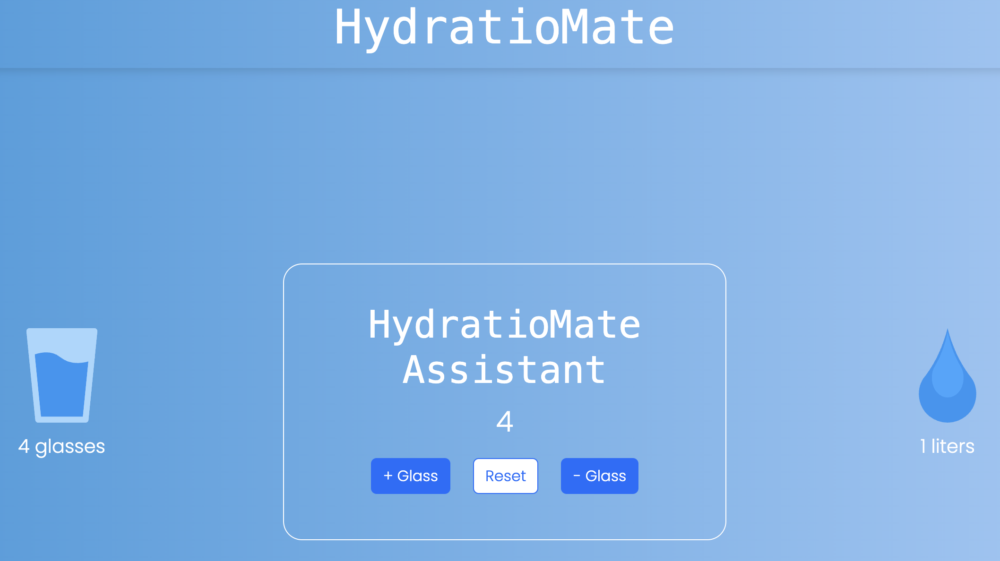

# HydratioMate

## Stay hydrated with HydratioMate Assistant

[](https://cdn.jsdelivr.net/npm/sweetalert2@11.0.20/dist/sweetalert2.min.js)
[](https://cdn.jsdelivr.net/npm/bootstrap@5.3.2/dist/js/bootstrap.min.js)

- [Overview](#overview)
- [Features](#features)
- [How To Use](#how-to-use)
- [Credits](#credits)
- [License](#license)

## Overview

HydratioMate is a web application designed to help you track your daily water intake and stay hydrated. It provides a simple and intuitive interface to record the number of glasses of water you consume throughout the day.



**Live Demo**: [HydratioMate](https://hydratiomate.netlify.app/){:target="_blank"}

## Features

- Track your daily water intake
- Set and achieve hydration goals
- Receive congratulatory messages on reaching milestones
- Responsive design for seamless use on various devices
- Integration with Sweetalert2 and Bootstrap for enhanced user experience

## How To Use

To use HydratioMate, follow these steps:

1. Clone this repository:

    ```bash
    git clone https://github.com/francescovitale-dev/hydratio-mate
    ```

2. Open the `index.html` file in your web browser.

3. Start tracking your water intake by using the buttons to increment, decrement, or reset your glass count.

## Credits

HydratioMate utilizes the following technologies, languages, and libraries:

- [HTML](https://developer.mozilla.org/en-US/docs/Web/HTML){:target="_blank"}
- [CSS](https://developer.mozilla.org/en-US/docs/Web/CSS){:target="_blank"}
- [Bootstrap](https://getbootstrap.com/){:target="_blank"}
- [JavaScript](https://developer.mozilla.org/en-US/docs/Web/JavaScript){:target="_blank"}
- [Sweetalert2](https://sweetalert2.github.io/){:target="_blank"}

---

> [vitalefrancesco.com](https://www.vitalefrancesco.com) &nbsp;&middot;&nbsp;
> GitHub [@francescovitale-dev](https://github.com/francescovitale-dev){:target="_blank"}
